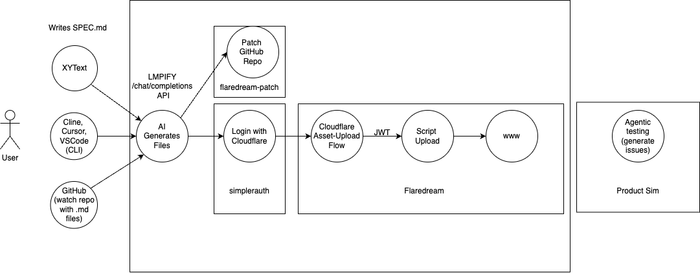

<!-- Head down focus on this -->

CRITICAL

- **Charge broken** - Just log it and see what's up, fix on stripeflare. Might even be DORM problem. MESSY!
- Turn payment system into XMoney so people can pay each other.
- Turn letmeprompt into oauth-provided `/chat/completion` endpoint with models (chance to not niche down too much and build flaredream chat with little complexity!)
- Turn `{subdomain}.letmeprompt.com/chat/completions` into the same thing, but with predetermined system prompt that is someone elses prompt. Results would not show the systemprompt, and would only be available with that model, but would still get their own new subdomain.

Ultimately I'd want to be able to set worker-name, repo-name, branch, and have these deployments happen automatically, instantly. For this to work, I require `Login with Cloudflare` and `Login with GitHub` to be a part of letmeprompt.com, and allow for generation-configs (name, repo, branch, worker-name). It's not clear to me yet if this should be a completely new app that uses letmeprompt.com? Maybe better; niched towards easy workers: flaredream!

# Proper way to let REPOS pay for generations, not users.

The UI here is not nice: https://github.com/eastlondoner/vibe-tools

- it leads to use a bad model
- people may hit a ratelimit very quickly

What I'd want is a custom link that redirects to the cached response, e.g. https://contextjson.com/{owner}/{repo}/tree/{branch}/context/{id}. This should:

1. Check the `context.json` in the raw githubusercontent file
2. Generate uithub URL+prompt
3. With MY OWN API KEY (AND COST), call `POST https://letmeprmpt.com/chat/completions` with preset model (if url/prompt didn't change, result should be cached). Also, result should include `X-Result-URL` header.
4. Redirect user to `X-Result-URL` where the result is being streamed to, paid for them.

After I have this, remove cheaper, smaller models; definitely discourage them. I can allow a budget of up to $5 free for anyone that puts a `context.json` file in their repo, but also should already have a way to see who's using it in a dashboard, and reach out to them easily.

# with-money refactor (Dependency)

Replace Stripeflare with X Money (more reliable for all users, allows to see who created something with nice X profile pic, etc)

https://github.com/janwilmake/with-money

To simplify, let's also just require login; ideally after filling first prompt (Should temporarily store prompt in cookie).

Ensure it doesn't logout quickly.

This would also allow getting an API KEY and more securely deposit lots of cash. To easily to build against LMPIFY with XYTEXT. also will allow closed-loop monetary system between creators and generations of these prompts, etc.

# Images as context, videos as context

HTML is terrible since it's too big. However as a screenshot it can be great for making websites. Let's nudge people when they used a HTML context to instead use it as image. When clicked, it prepends https://quickog.com/{url}, which screenshots it.

Any URL that's an image should be inserted as image context to the model. Now we can do some sick sick stuff!

Video urls should be inserted as video context to the model (if the model supports it)

Whenever context is an image, it should show the # of tokens and it should show the fact that it's an image in the context UI.

# Variables

What if:

- If you prompt something with `{{var1}}` and `{{var2}}` it is required to be filled. This can be part of URLs too!
- https://letmeprompt.com/[id]/{{var1}}/{{var2}} is where you first get your result. Without variables, it should prompt to pass them.
- `https://[id].gptideas.com/{{var1}}/{{var2}}` is static results with routing (basepath being after variables; this now functions as API!)
- https://[id].chatcompletions.com/chat/completions would allow using the prompt + context as system prompt with additional variables in the headers in `variables:Object`. These would be required if they are present.

These are all GREAT primitives to allow making prompts more flexible

https://letmeprompt.com/httpsmarkdownfeed-jqin4k0 would be able to be done with variable. Imagine we could also choose a name: `xcategories`.

Now, https://xcategories.gptideas.com/janwilmake/categories.yaml should magically trigger prompting the same for me, IF I authorized it (either lazy with auth token, or predone with scope). We can now use this as some sort of API

Imagine now that we could also configure the scope and max-age. This would make this API truly valuable. It's a lot of extra complexity, and can be made more generically for URLs too, so maybe should be separated from letmeprompt itself, however, I could definitely see this as a quick way to prototype APIs. The API in-browser could then also immediately be the place where you find all results in one place.

I think a great place to start is:

- Establish as OAuth provider (login with letmeprompt)
- Ability to name prompts to replace, configure, budget for them later
- Named prompts should get history/versions and a DO as storage for all versions, including with variables.
- Variables in prompts should become indexes in the SQLite DB.
