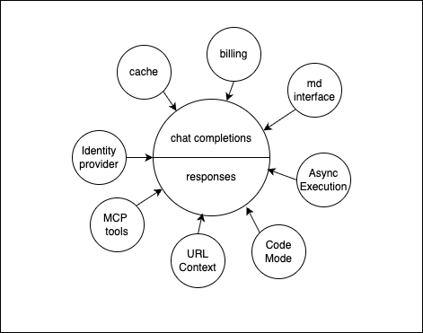

# Bringing all pieces together to be at the Frontier of AI inference design

Right when everybody got used to `/chat/completions`, [OpenAI introduced a new direction: Responses](https://developers.openai.com/blog/responses-api/)

At the core, ai companies create models that takes tokens in and streams tokens out. These models need to be hosted on large GPUs to do inference for the end-user. Around that there are a lot of pieces that you may want to add:

- response caching
- billing
- identity provider
- url context
- mcp tool use
- code mode
- cronjobs
- async execution

Creating developer or user experiences that combine some or all of the above is more of an artform than simply following rules in a book.
